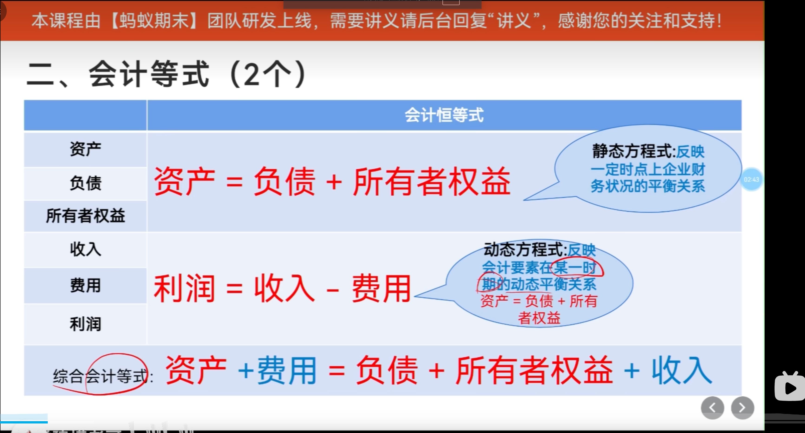

# 

# 会计等式 (2个)

资产 = 负债 + 所有者权益
    = 负载（流动负债 + 非流动负债） + 所有者权益

利润 = 收入 - 费用

### 综合会计等式
资产 + 费用 = 负债 + 所有者权益 + 收入

负债，分为 
- “流动负载” ：短期内（比如说一年之内），是需要偿还的
- “非流动负载”：长期负载 （长期不用偿还的）

# 借贷

## eg.

「贷」会让科目变大还是变小？（看科目性质）
同一侧「借」或「贷」，对不同类科目的含义不同，这是初学者最容易混的地方：

科目大类	增加记在哪一侧	减少记在哪一侧
资产、费用	借方	贷方
负债、所有者权益、收入	贷方	借方
举例：

用银行存款买设备：银行存款（资产）减少 → 记贷方；固定资产（资产）增加 → 记借方。
赊购材料：应付账款（负债）增加 → 记贷方；原材料（资产）增加 → 记借方。
所以：「贷」本身不表示「好」或「坏」，只表示这一笔在贷方；是增是减要看这是哪一类科目。

1. 固定资产（资产）增加 → 记借方。
2. 原材料（资产）增加 → 记借方

3. 用银行存款买设备：银行存款（资产）减少 → 记贷方；
4. 赊购材料：应付账款（负债）增加 → 记贷方；

和「贷款」一词的关系
汉字「贷」日常常和借款有关，但在会计术语里是历史沿用下来的 **「贷方」** 叫法。
看到分录里的「贷」，应条件反射成：这是复式记账里与「借」相对的那一侧，再结合科目判断是增加还是减少。

如果你愿意，可以说一个你工作中的具体分录（例如报销、收款、计提折旧），我可以按「借 / 贷」帮你标一遍，会更快建立直觉。

